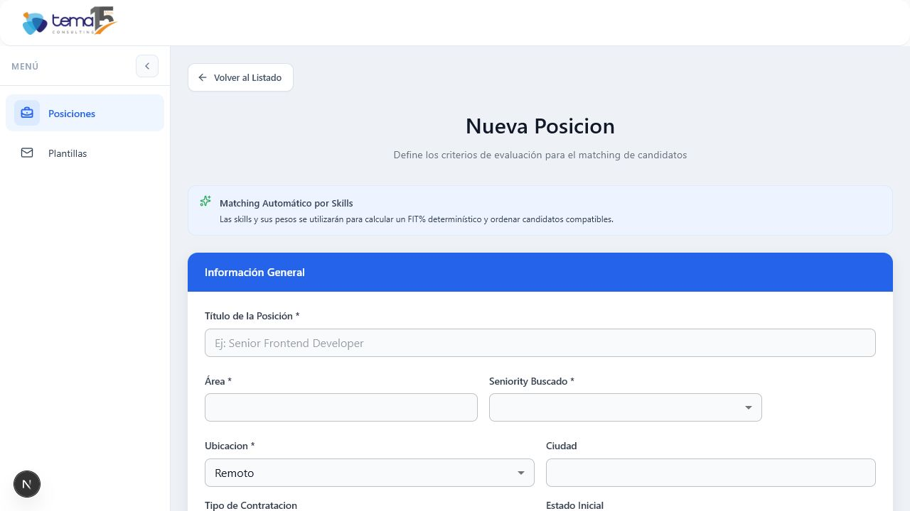
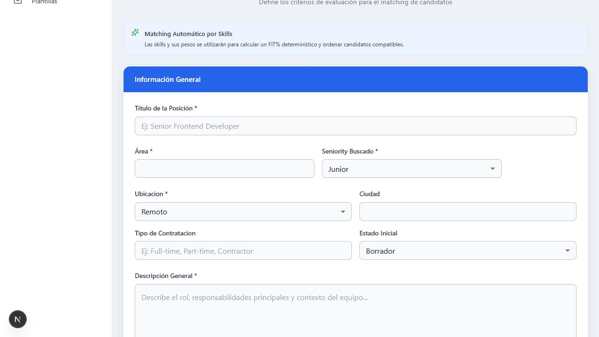

## Summary

- Changed the expected seniority field in the position creation form from free text to a dropdown.
- Applied the same dropdown in the position edit form for consistency.
- Kept the persisted values compatible with existing data: `junior`, `semi-senior`, `senior`.

## Screenshots

Before selecting a value:

After selecting a value:

## Validation

- Ran `pnpm.cmd --filter @ats/web check-types`.
- Verified locally in dev mode at `/dashboard/positions/create`.
- Confirmed the dropdown options exposed by the UI are `Junior`, `Semi Senior`, and `Senior`.
